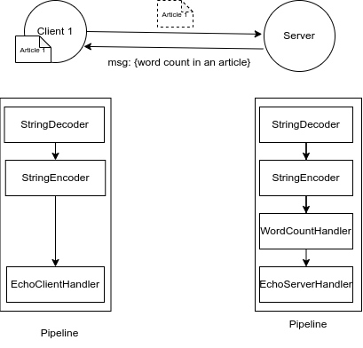
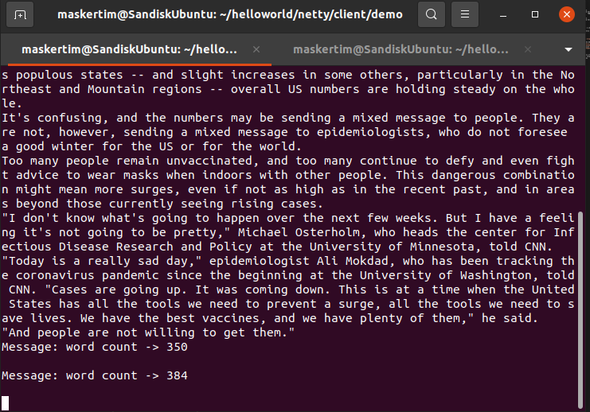
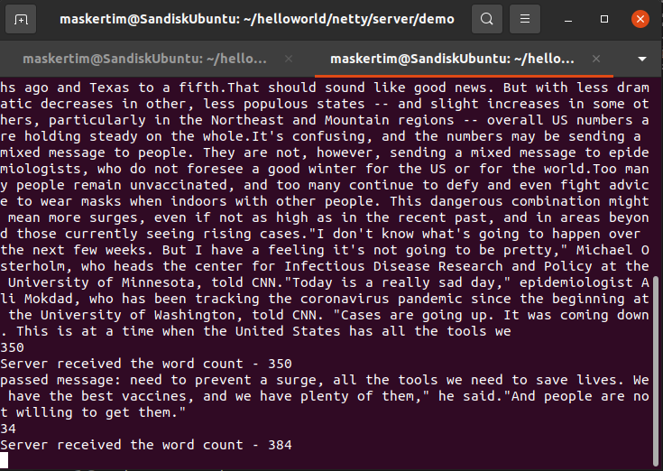

# Netty HelloWorld
This is a HelloWorld sample of netty io.
A client sends an article to server.
A server calculate the word count in the article from client, then return word count in all content.

## HelloWorld Design
* The Simple HelloWorld based on client-server architecture.


## Directory Structure
* `client` directory is for client service.
* `server` directory is for server service.
```
.
├── articles
├── client
│   └── demo
│       ├── src
│           ├── main
│           │   └── java
│           │       └── com
│           │           └── helloworld
│           │               └── client
│           └── test
│               └── java
│                   └── com
│                       └── helloworld
├── pics
└── server
    └── demo
        ├── src
            ├── main
            │   └── java
            │       └── com
            │           └── helloworld
            │               └── server
            └── test
                └── java
                    └── com
                        └── helloworld
        
```

## How to Run
* Package the project into a jar file.
    `mvn package`
* Package the netty dependency library into a jar file.
    `mvn assembly:single`
* Execute it.
    `java -cp target/{netty_dependency_jar}:target/{entry_point_jar}`
    * Default the jar of the dependecies is `{your artifact name}-1.0-SNAPSHOT-jar-with-dependencies.jar` and the jar of entry point is `{your artifact name}-1.0-SNAPSHOT.jar`

## Show Console
* `Client` Console:

* `Server` Console:


## Contribution
* Hao-Ying Cheng
    * Email: t109598001@ntut.org.tw
    * Affliation: National Taipei University of Technology